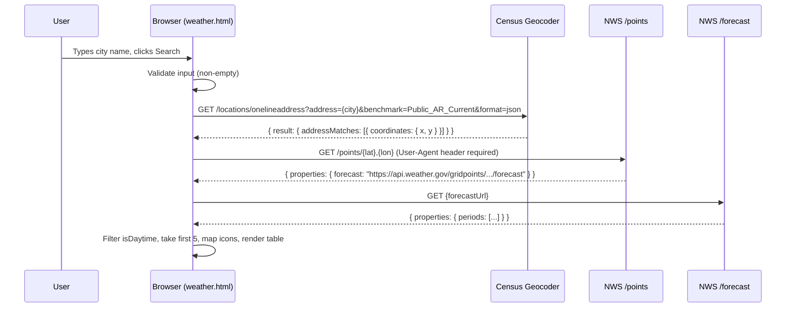

# Design Document: weather-app

## Overview

The weather-app is a minimal, dependency-free browser application that lets users look up the 5-day weather forecast for any US city. The entire client is a single `weather.html` file served by a `server.ps1` PowerShell script using only built-in .NET (`System.Net.HttpListener`). No build tools, no npm, no Python.

**Key technology choices:**
- **US Census Bureau Geocoding API** (`https://geocoding.geo.census.gov`) — resolves a city name to latitude/longitude coordinates.
- **National Weather Service API** (`https://api.weather.gov`) — provides the authoritative NWS forecast in JSON-LD/GeoJSON format. Requires two requests: `/points/{lat},{lon}` then the `forecast` URL returned in the response.
- **Vanilla JS + HTML** — no frameworks. DOM manipulation and `fetch()` only.
- **PowerShell `HttpListener`** — zero-dependency local file server.

Research findings:
- The Census Geocoder requires a structured address (building number + street are *required* per the API spec). For a city-name-only lookup, the workaround is to pass the city as a `onelineaddress` value (e.g., `"Austin, TX"`) along with `benchmark=Public_AR_Current`. The API will often return a result at the city centroid. [Source: geocoding.geo.census.gov/geocoder/Geocoding_Services_API.html]
- The NWS `/points/{lat},{lon}` endpoint accepts up to 4 decimal places of precision and returns `properties.forecast` (the gridded forecast URL). [Source: weather-gov.github.io/api/general-faqs]
- The NWS forecast response returns `properties.periods[]` — an array alternating day/night. To get 5 days, filter for `isDaytime === true` and take the first 5.
- NWS requires a `User-Agent` header on every request or it will return 403.

---

## Architecture

The app has two files and no shared build state between them.

```
weather.html   — client: HTML + embedded CSS + embedded JavaScript
server.ps1     — server: PowerShell HttpListener serving weather.html
```



The PowerShell server is a simple pass-through: it reads `weather.html` from disk on every request and streams it back with `Content-Type: text/html`.

---

## Components and Interfaces

### weather.html — Internal Modules (as JS functions)

| Function | Signature | Responsibility |
|---|---|---|
| `handleSearch()` | `() => Promise<void>` | Orchestrates the full lookup flow |
| `geocode(city)` | `(string) => Promise<{lat, lon}>` | Calls Census Geocoder, extracts first result |
| `getNWSPoints(lat, lon)` | `(number, number) => Promise<string>` | Calls `/points`, returns forecast URL |
| `getForecast(forecastUrl)` | `(string) => Promise<Period[]>` | Calls forecast URL, returns periods array |
| `filterDaytimePeriods(periods)` | `(Period[]) => Period[]` | Filters `isDaytime === true`, slices first 5 |
| `getWeatherIcon(shortForecast)` | `(string) => string` | Maps forecast description to emoji/SVG icon |
| `renderTable(periods)` | `(Period[]) => void` | Builds and inserts table rows into the DOM |
| `showError(message)` | `(string) => void` | Displays the Error_Banner |
| `hideError()` | `() => void` | Hides the Error_Banner |
| `setLoading(isLoading)` | `(boolean) => void` | Shows/hides spinner, disables/enables controls |

### DOM Elements

| ID | Element | Purpose |
|---|---|---|
| `#city-input` | `<input type="text">` | City name entry |
| `#search-btn` | `<button>` | Trigger search |
| `#error-banner` | `<div>` | Error message display (hidden by default) |
| `#loading` | `<div>` | Spinner/loading text (hidden by default) |
| `#forecast-table` | `<table>` | 5-day forecast results |
| `#forecast-tbody` | `<tbody>` | Forecast row container (cleared on each search) |

### server.ps1 Interface

The PowerShell server exposes no API surface — it is a file server only. It responds to all `GET /` requests with the content of `weather.html`.

```
Start: PS> .\server.ps1
  → Prints: "Weather app running at http://localhost:8080 — press Ctrl+C to stop."
Stop: Ctrl+C
  → try/finally block disposes HttpListener cleanly
```

---

## Data Models

### Census Geocoder Response (relevant subset)

```js
// GET https://geocoding.geo.census.gov/geocoder/locations/onelineaddress
//   ?address=Austin%2C+TX&benchmark=Public_AR_Current&format=json
{
  result: {
    addressMatches: [
      {
        coordinates: {
          x: -97.7431,   // longitude
          y: 30.2672     // latitude
        },
        matchedAddress: "AUSTIN, TX, 78701"
      }
      // ... more matches
    ]
  }
}
```

**Note:** The Census API uses `x` for longitude and `y` for latitude — the opposite of the conventional (lat, lon) order. `geocode()` must extract `y` as `lat` and `x` as `lon`.

### NWS /points Response (relevant subset)

```js
// GET https://api.weather.gov/points/30.2672,-97.7431
{
  properties: {
    forecast: "https://api.weather.gov/gridpoints/EWX/155,91/forecast",
    forecastHourly: "...",
    gridId: "EWX",
    gridX: 155,
    gridY: 91
  }
}
```

### NWS Forecast Period

```js
// Single element from properties.periods[]
{
  number: 1,
  name: "Today",
  startTime: "2025-01-15T06:00:00-06:00",
  isDaytime: true,
  temperature: 72,
  temperatureUnit: "F",
  windSpeed: "10 mph",
  windDirection: "SSW",
  shortForecast: "Mostly Sunny",
  detailedForecast: "Mostly sunny, with a high near 72..."
}
```

### Rendered Table Row

Each `<tr>` in `#forecast-tbody` contains:

| Column | Source Field | Example |
|---|---|---|
| Date | `period.name` | "Today" / "Thursday" |
| Icon | `getWeatherIcon(period.shortForecast)` | ☀️ |
| Temp | `period.temperature` + `°F` | 72°F |
| Conditions | `period.shortForecast` | "Mostly Sunny" |
| Wind | `period.windSpeed` + `period.windDirection` | 10 mph SSW |

### Weather Icon Mapping

The `getWeatherIcon(shortForecast)` function converts NWS description strings to icons via case-insensitive keyword matching. Matching is checked in priority order (most specific first):

| Priority | Keywords | Icon | Condition |
|---|---|---|---|
| 1 | `snow`, `blizzard`, `flurr` | ❄️ | Snowy |
| 2 | `rain`, `shower`, `drizzle`, `thunderstorm`, `storm` | 🌧️ | Rainy |
| 3 | `partly cloudy`, `mostly cloudy`, `partly sunny` | ⛅ | Partly Cloudy |
| 4 | `cloudy`, `overcast`, `fog`, `haz` | ☁️ | Cloudy |
| 5 | `sunny`, `clear` | ☀️ | Sunny/Clear |
| 6 | _(no match)_ | 🌡️ | Unknown/Default |

---

## Correctness Properties

*A property is a characteristic or behavior that should hold true across all valid executions of a system — essentially, a formal statement about what the system should do. Properties serve as the bridge between human-readable specifications and machine-verifiable correctness guarantees.*

### Property 1: Empty and whitespace city input is rejected

*For any* string composed entirely of whitespace characters (including the empty string), submitting it as a city input SHALL prevent any geocoder call from being made and SHALL result in the Error_Banner being displayed.

**Validates: Requirements 1.3**

---

### Property 2: Valid city input is passed verbatim to the geocoder

*For any* non-empty, non-whitespace city name string, calling `geocode(city)` SHALL construct a request URL that contains the city string as the `address` parameter value (URL-encoded).

**Validates: Requirements 1.2, 2.1**

---

### Property 3: Geocoder first result is always used for coordinates

*For any* Census Geocoder response containing one or more `addressMatches`, calling `geocode()` SHALL return the `y` value of `addressMatches[0].coordinates` as the latitude and the `x` value as the longitude, regardless of how many total matches are in the response.

**Validates: Requirements 2.2**

---

### Property 4: NWS forecast URL is extracted from the points response

*For any* valid NWS `/points` response object, calling `getNWSPoints()` SHALL return the string value at `response.properties.forecast`, and that value SHALL be a well-formed HTTPS URL.

**Validates: Requirements 2.3**

---

### Property 5: Any error condition produces a visible, non-empty error message

*For any* error condition the app can encounter — including geocoder returning zero results, geocoder HTTP error, NWS `/points` HTTP error, NWS `/forecast` HTTP error, or network failure — the Error_Banner SHALL be made visible and its text content SHALL be a non-empty, human-readable string identifying which service failed.

**Validates: Requirements 2.4, 2.5, 4.2**

---

### Property 6: Forecast table always shows exactly 5 daytime rows

*For any* valid NWS forecast response containing five or more daytime periods (`isDaytime === true`), calling `filterDaytimePeriods()` SHALL return exactly 5 periods, and `renderTable()` SHALL produce exactly 5 `<tr>` elements in `#forecast-tbody`.

**Validates: Requirements 3.1**

---

### Property 7: Every rendered forecast row contains all required fields

*For any* valid NWS forecast period object, the `<tr>` produced by `renderTable()` for that period SHALL contain non-empty text for: the period name (date), temperature with unit (°F), short forecast description, wind speed, and wind direction, and SHALL contain a non-empty icon character.

**Validates: Requirements 3.2**

---

### Property 8: Icon mapper returns a non-default icon for all recognized weather keywords

*For any* `shortForecast` string that contains at least one of the recognized keywords (`snow`, `rain`, `shower`, `drizzle`, `storm`, `cloudy`, `overcast`, `fog`, `sunny`, `clear`, `partly`), `getWeatherIcon()` SHALL return an icon that is not the default fallback icon (🌡️), and the icon SHALL correspond to the correct condition category for that keyword.

**Validates: Requirements 3.3**

---

## Error Handling

| Condition | Detection | User-Facing Message |
|---|---|---|
| Empty/whitespace city input | Pre-flight validation in `handleSearch()` | "Please enter a city name." |
| Geocoder returns no matches | `addressMatches.length === 0` | "City not found. Try adding a state abbreviation (e.g., 'Austin, TX')." |
| Geocoder HTTP error / network failure | `fetch()` rejection or `!response.ok` | "Could not reach the geocoding service. Check your connection." |
| NWS `/points` HTTP error | `!response.ok` | "The NWS weather service is unavailable. Try again shortly." |
| NWS `/forecast` HTTP error | `!response.ok` | "Could not retrieve forecast data. Try again shortly." |
| NWS `/points` outside US coverage | 404 from NWS | "No NWS coverage for this location. NWS only covers the US." |
| Forecast has fewer than 5 daytime periods | `filteredPeriods.length < 5` | Render however many are available — no error shown. |

All errors flow through `showError(message)`, which sets `#error-banner` text and removes the `hidden` CSS class. `setLoading(false)` is always called in a `finally` block to guarantee controls are re-enabled.

```js
async function handleSearch() {
  hideError();
  const city = document.getElementById('city-input').value.trim();
  if (!city) { showError('Please enter a city name.'); return; }

  setLoading(true);
  try {
    const { lat, lon } = await geocode(city);
    const forecastUrl   = await getNWSPoints(lat, lon);
    const periods       = await getForecast(forecastUrl);
    const days          = filterDaytimePeriods(periods);
    renderTable(days);
  } catch (err) {
    showError(err.message);
  } finally {
    setLoading(false);
  }
}
```

---

## Testing Strategy

Because this is a pure-function, single-file JavaScript application with no build toolchain, the testing approach uses the browser's native capabilities plus a lightweight, zero-dependency property-based testing library that can be loaded from a CDN in a separate test HTML file.

### Recommended Library

**fast-check** (MIT, actively maintained) — loaded from CDN in `weather.test.html`. No npm required.

```html
<script src="https://cdn.jsdelivr.net/npm/fast-check/lib/bundle/fast-check.js"></script>
```

Each property test runs a minimum of 100 iterations (`numRuns: 100`).

### Test File Structure

A single `weather.test.html` file imports the core JS logic extracted from `weather.html` (or the functions are module-exportable). Each test is tagged with its property number.

```
weather.html        — production app
weather.test.html   — property and unit tests (open in browser to run)
server.ps1          — HTTP server
```

### Property-Based Tests

Each test references a design property via a comment tag: `// Feature: weather-app, Property N: <property text>`

| Test | Property | Approach |
|---|---|---|
| Whitespace/empty input rejected | Property 1 | `fc.string()` filtered to whitespace; assert no fetch call, error banner visible |
| Valid city passed to geocoder | Property 2 | `fc.string({ minLength: 1 })` filtered non-whitespace; mock fetch, assert URL param |
| Geocoder first result used | Property 3 | `fc.array(fc.record({coordinates: fc.record({x: fc.float(), y: fc.float()})}), {minLength:1})`; assert lat/lon = result[0] |
| NWS forecast URL extracted | Property 4 | `fc.record({ properties: fc.record({ forecast: fc.webUrl() }) })`; assert return === properties.forecast |
| Any error → visible non-empty banner | Property 5 | `fc.oneof(fc.constant(0), fc.integer({min:400,max:599}))`; mock fetch with error; assert banner text non-empty |
| Exactly 5 daytime rows | Property 6 | `fc.array(daytimePeriod, {minLength:5})`; assert tbody has 5 `<tr>` elements |
| All fields in rendered row | Property 7 | `fc.record(periodArbitrary)`; render; assert all columns non-empty |
| Known keywords → correct icon | Property 8 | `fc.constantFrom(...keywords)` + `fc.string()` around keyword; assert icon !== default |

### Unit / Example-Based Tests

| Test | Covers |
|---|---|
| Controls disabled during fetch | Requirement 1.4 |
| Controls re-enabled after completion | Requirement 3.5 |
| Table cleared on new search | Requirement 3.4 |
| Error banner hidden on new search | Requirement 4.3 |
| Loading indicator appears synchronously | Requirement 4.1 |
| Error banner persists until dismissed | Requirement 4.4 |
| `getWeatherIcon` returns ❄️ for "Snow showers" | Property 8 spot check |
| `getWeatherIcon` returns ☀️ for "Sunny" | Property 8 spot check |
| `getWeatherIcon` returns 🌡️ for unrecognized string | Default fallback |

### PowerShell Server Smoke Tests

Run manually or via a CI shell step:

| Test | Method |
|---|---|
| Server starts and prints URL | Read stdout after `Start-Process` |
| GET / returns 200 + HTML | `Invoke-WebRequest http://localhost:8080` |
| Content-Type is text/html | Check response headers |
| Server stops cleanly on Ctrl+C | Send process interrupt signal |
